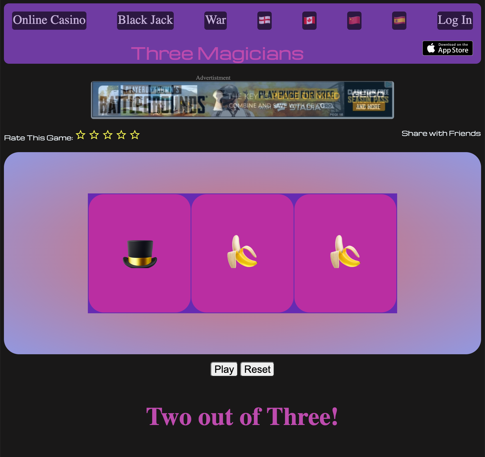

Game Title: Slot Machine. Using an array of emjois a function will return three random emojis from that array. Depending on wether all three slot match, two match, or none match, an event will be returned.

It's fun and kitschy ! => as is Las Vegas!

Technologies Used: Javascript,HTML, CSS

Getting Started: https://jozkan30.github.io/Slot_Machine-/

Next Steps: In the future I plan on an effect that will show the array spinning through the array as as making the navigation bar, ratings, and feed back sections active. Build out  back-end so that users can make account and purschase and store playing chips.

 I would also like to create a wallet feature that will add or subtract based on the result of the game. 

